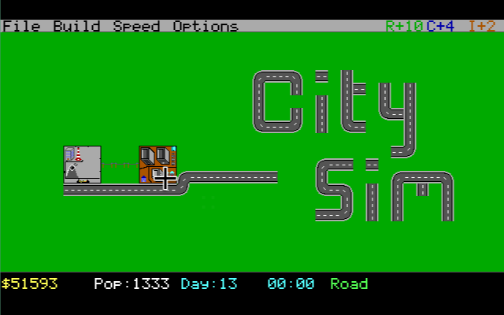

# CitySim - A City Building Simulation for DOS

A SimCity-inspired city building game for 386 DOS machines with EGA graphics (16 colours, 640x350 resolution).
There is also an SDL based tile editor to amend the graphics tiles, or create your own!



## Development Status
This game is still in very early development stages, the basic logic is working now, but tiles haven't all been drawn and many features don't work yet

## System Requirements

- 386 processor or better
- Ideally 4MB RAM (may work on less, haven't tested)
- EGA graphics card (16 colours, 640x350)
- DOS 5.0 or later (or DOSBox)

## Building from source

### Prerequisites to build

- Open Watcom C/C++ compiler
- DOS4GW extender (included with Open Watcom, or run `get_dos4gw.sh`)

### Compile

```bash
wmake
```

Or use the build script:

```bash
./build.sh
```

### Run in DOSBox or on real hardware

note you need dos4gw or equivalents (run get_dos4gw.sh if you want help)
```bash
dosbox dos4gw citysim.exe
```

## Controls

### City View

| Key       | Action                    |
|-----------|---------------------------|
| Arrows    | Move cursor (auto-scrolls)|
| Space     | Place selected tile       |
| R         | Select Residential ($100) |
| C         | Select Commercial ($150)  |
| I         | Select Industrial ($200)  |
| D         | Select Road ($10)         |
| P         | Select Park ($50)         |
| H         | View nearest citizen      |
| Z         | View random citizen       |
| F1        | Help screen               |
| ESC       | Quit game                 |

### Human View

| Key       | Action                    |
|-----------|---------------------------|
| ESC       | Return to city view       |
| Z         | Return to city view       |

## Status Bar

The bottom of the screen shows:

- **$** (yellow) - Current funds
- **POP:** (white) - Population count
- **DAY:** (cyan) - Current day number
- **Time** (cyan) - Current hour (HH:00)
- **TOOL:** (green) - Currently selected building type
- **Coordinates** (grey) - Cursor position on the map

## Gameplay

### Getting Started

You begin with $50,000, a power plant, a water pump, some roads, and a few starter zones. Power plants and water pumps provide services within a 5-tile radius. Residential zones with both power and water will attract citizens.

### Building Costs

| Type         | Cost    | Colour        |
|--------------|---------|---------------|
| Residential  | $100    | Yellow        |
| Commercial   | $150    | Light Blue    |
| Industrial   | $200    | Brown         |
| Road         | $10     | Dark Grey     |
| Park         | $50     | Light Green   |
| Police       | $500    | Cyan          |
| Fire Station | $500    | Red           |
| Hospital     | $1,000  | White         |
| School       | $800    | Magenta       |
| Power Plant  | $5,000  | Light Red     |
| Water Pump   | $2,000  | Light Cyan    |

### Economy

- Tax collection: $5 per citizen per day (collected at midnight)
- Build wisely to maintain positive cash flow

### Human Simulation

Citizens follow daily routines (sleeping, eating, commuting, working, leisure) and have stats (happiness, health, wealth, education) affected by city services and conditions.

## Architecture

| File        | Purpose                              |
|-------------|--------------------------------------|
| citysim.h   | Structures, constants, prototypes    |
| main.c      | Game loop, render orchestration      |
| graphics.c  | EGA graphics, 5x7 bitmap font, UI   |
| game.c      | Simulation, input, economy           |

### Technical Details

- EGA mode 0x10: 640x350, 16 colours, 4 bit planes
- 16x16 pixel tiles, 40x21 visible tile viewport
- 64x64 tile map, up to 256 citizens, 512 buildings
- 20 FPS target (50ms frame delay)
- Direct video memory writes at 0xA0000
- Built with Open Watcom for DOS4GW protected mode

## Known Limitations

- No sound
- Simple direct-line pathfinding (no A*)
- Service buildings (police, fire, hospital, school) are placeable but have no gameplay mechanics yet

## Licence
GNU GPL v2

This is entirely a hobby for Educational / demonstration software purposes only.

